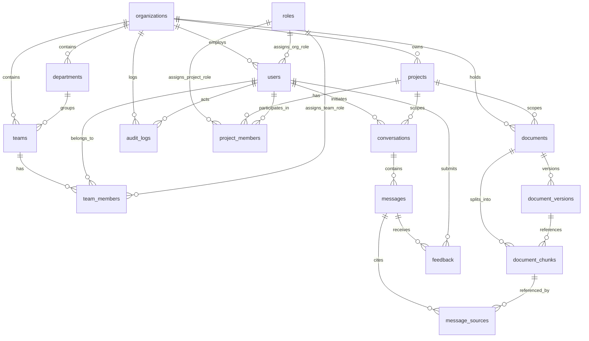

# ARIA — PostgreSQL Database Architecture

> **A**nnotation **R**AG **I**ntelligence **A**ssistant  
> Production-grade multi-project database specification powered by PostgreSQL 16, `pgvector`, and Supabase Row Level Security (RLS).

---

## 1. Architectural Overview

The ARIA database layer is engineered for enterprise-grade multi-tenant LiDAR annotation knowledge retrieval. It combines relational hierarchies (Organizations → Departments → Teams → Projects) with high-dimensional vector embeddings and append-only audit tracking.

### Key Capabilities
- **Multi-Tenancy & Project Isolation**: Hierarchical permission model enforcing data separation across organizations and project boundaries.
- **pgvector Semantic Search**: 1536-dimensional vector store optimized for cosine similarity search with IVFFlat indexing (`vector_cosine_ops`).
- **Atomic Document Versioning**: Monotonically increasing versions with SHA-256 integrity checksums and storage path resolution.
- **Explainable RAG Citations**: `message_sources` links every assistant output back to specific chunks and page excerpts with relevance scores.
- **Comprehensive Audit Trail**: Append-only tamper-resistant logs recording all authentication, data ingestion, and mutation events.
- **Supabase Row Level Security (RLS)**: Fine-grained declarative data security executed at the database engine level.

---

## 2. Entity Relationship Diagram (ERD)



---

## 3. Table Catalog & Specifications

### 3.1 Organization & User Management

#### `organizations`
Top-level multi-tenant boundary. All downstream records resolve to an organization.

| Column | Type | Constraints | Description |
|---|---|---|---|
| `id` | `UUID` | `PRIMARY KEY`, default `uuid_generate_v4()` | Unique tenant identifier |
| `name` | `TEXT` | `NOT NULL` | Legal or display organization name |
| `slug` | `TEXT` | `NOT NULL`, `UNIQUE` | URL-safe slug (e.g. `autocruise-ai`) |
| `logo_url` | `TEXT` | `NULL` | Organization brand logo URI |
| `website` | `TEXT` | `NULL` | Company website |
| `settings` | `JSONB` | `NOT NULL`, default `'{}'` | Tenant configuration, model choices, quota limits |
| `is_active` | `BOOLEAN` | `NOT NULL`, default `TRUE` | Tenant operational status |
| `created_at` | `TIMESTAMPTZ` | `NOT NULL`, default `NOW()` | Creation timestamp |
| `updated_at` | `TIMESTAMPTZ` | `NOT NULL`, default `NOW()` | Auto-updated via trigger |

---

#### `departments`
Functional operational groups within an organization (e.g., Perception, QA, Tooling).

| Column | Type | Constraints | Description |
|---|---|---|---|
| `id` | `UUID` | `PRIMARY KEY` | Department identifier |
| `organization_id` | `UUID` | `NOT NULL`, `REFERENCES organizations(id) ON DELETE CASCADE` | Parent organization |
| `name` | `TEXT` | `NOT NULL` | Department name |
| `description` | `TEXT` | `NULL` | Description of department domain |
| `created_at` / `updated_at` | `TIMESTAMPTZ` | `NOT NULL` | Timestamps |

*Constraint*: `UNIQUE(organization_id, name)`

---

#### `roles`
Role-Based Access Control (RBAC) permission definitions.

| Column | Type | Constraints | Description |
|---|---|---|---|
| `id` | `UUID` | `PRIMARY KEY` | Role identifier |
| `name` | `TEXT` | `NOT NULL` | Role name (`super_admin`, `annotator`, etc.) |
| `scope` | `role_scope` | `NOT NULL` (`system`, `organization`, `project`) | Scoping level |
| `permissions` | `JSONB` | `NOT NULL`, default `'[]'` | List of granted permission strings |
| `is_system` | `BOOLEAN` | `NOT NULL`, default `FALSE` | Protected system role flag |
| `description` | `TEXT` | `NULL` | Human-readable role description |

*Pre-seeded System Roles*:
- `super_admin` (`system`): `["*"]`
- `org_admin` (`organization`): `["org.*", "project.*", "user.*", "document.*"]`
- `project_lead` (`project`): `["project.read", "project.write", "document.*", "conversation.*"]`
- `annotator` (`project`): `["project.read", "document.read", "document.upload", "conversation.*"]`
- `viewer` (`project`): `["project.read", "document.read", "conversation.read"]`

---

#### `users`
Human accounts operating within the system.

| Column | Type | Constraints | Description |
|---|---|---|---|
| `id` | `UUID` | `PRIMARY KEY` | User ID (maps directly to Supabase `auth.users.id`) |
| `organization_id` | `UUID` | `NOT NULL`, `REFERENCES organizations(id) ON DELETE CASCADE` | Associated organization |
| `role_id` | `UUID` | `REFERENCES roles(id) ON DELETE SET NULL` | Org-level default role |
| `email` | `TEXT` | `NOT NULL`, `UNIQUE` | User email address |
| `name` | `TEXT` | `NOT NULL` | Full display name |
| `avatar_url` | `TEXT` | `NULL` | User profile avatar URI |
| `status` | `user_status` | `NOT NULL` (`pending`, `active`, `inactive`, `suspended`) | User account lifecycle status |
| `last_seen_at` | `TIMESTAMPTZ` | `NULL` | Last platform interaction timestamp |
| `metadata` | `JSONB` | `NOT NULL`, default `'{}'` | Custom profile attributes |

---

### 3.2 Teams & Projects

#### `teams` & `team_members`
Cross-functional operational squads working across departments and projects.

- `teams`: Linked to `organizations` (`CASCADE`) and optional `departments` (`SET NULL`).
- `team_members`: Composite primary key `(team_id, user_id)` with optional team-level role override.

---

#### `projects` & `project_members`
Autonomous workspace containing project-specific annotation documents, schemas, and chat threads.

- `projects`: Contains metadata settings like coordinate frame convention (e.g. `ISO 8855`), point cloud compression formats, and class taxonomy rules.
- `project_members`: Composite key `(project_id, user_id)` with `role_id` referencing a project-scoped role (`project_lead`, `annotator`, `viewer`).

---

### 3.3 Knowledge Base & pgvector Document Engine

#### `documents`
Master knowledge assets cataloging LiDAR manuals, label specs, calibration guidelines, and FAQs.

| Column | Type | Constraints | Description |
|---|---|---|---|
| `id` | `UUID` | `PRIMARY KEY` | Document identifier |
| `project_id` | `UUID` | `NOT NULL`, `REFERENCES projects(id) ON DELETE CASCADE` | Bound project |
| `organization_id` | `UUID` | `NOT NULL`, `REFERENCES organizations(id) ON DELETE CASCADE` | Tenant organization |
| `uploaded_by` | `UUID` | `REFERENCES users(id) ON DELETE SET NULL` | Uploading user |
| `title` | `TEXT` | `NOT NULL` | Document title |
| `doc_type` | `doc_type` | `NOT NULL` (`manual`, `spec`, `faq`, `guide`, `annotation_schema`, `other`) | Document classification |
| `status` | `doc_status` | `NOT NULL` (`pending`, `processing`, `indexed`, `failed`, `archived`) | Ingestion pipeline status |
| `source_url` | `TEXT` | `NULL` | Original storage bucket or URL |
| `file_size_bytes` | `BIGINT` | `NULL` | Size in bytes |
| `mime_type` | `TEXT` | `NULL` | MIME format (`application/pdf`, etc.) |
| `page_count` | `INTEGER` | `NULL` | Total pages (if paginated) |
| `language` | `TEXT` | `NOT NULL`, default `'en'` | ISO-639 language code |
| `metadata` | `JSONB` | `NOT NULL`, default `'{}'` | Custom taxonomy, sensor tags, revision |

---

#### `document_versions`
Immutable version snapshots enabling historical rollbacks and audit verification.

- `version_number`: Monotonically increasing sequence per document (`1, 2, 3...`).
- `storage_path`: S3 / Supabase storage bucket path.
- `checksum`: SHA-256 hexadecimal hash for dedup and data integrity validation.
- `is_current`: Partial unique index guarantees exactly one active version per document.

---

#### `document_chunks` (pgvector Storage)
Individual text segments indexed for semantic retrieval.

| Column | Type | Constraints | Description |
|---|---|---|---|
| `id` | `UUID` | `PRIMARY KEY` | Chunk identifier |
| `document_id` | `UUID` | `NOT NULL`, `REFERENCES documents(id) ON DELETE CASCADE` | Parent document |
| `version_id` | `UUID` | `REFERENCES document_versions(id) ON DELETE SET NULL` | Snapshot version |
| `chunk_index` | `INTEGER` | `NOT NULL` | Sequential position within document |
| `content` | `TEXT` | `NOT NULL` | Raw chunk text content |
| `token_count` | `INTEGER` | `NULL` | Number of tokens in chunk |
| `status` | `chunk_status` | `NOT NULL` (`pending`, `embedded`, `failed`) | Embedding pipeline state |
| `embedding` | `vector(1536)` | `NULL` | **pgvector** embedding (OpenAI / DeepSeek dimensions) |
| `metadata` | `JSONB` | `NOT NULL`, default `'{}'` | Page number, section header, bounding box tags |

*Unique Constraint*: `UNIQUE(document_id, chunk_index)`

---

### 3.4 Conversations, Messages & Explainable RAG

#### `conversations`
Persistent conversation threads between users and ARIA. Optionally scoped to a specific `project_id`.

#### `messages`
Individual dialogue turns with model latency, token consumption, and finish reason telemetry.

#### `message_sources`
Direct grounding link between an assistant message and the underlying `document_chunks` used to formulate the answer.
- `relevance`: Cosine similarity score `[0.0, 1.0]`.
- `excerpt`: Text snippet rendered in the citation UI.
- `page_number`: Direct page jump link for PDF viewers.

#### `feedback`
User feedback (`thumbs_up` / `thumbs_down` + optional text commentary). Enforces 1 rating per (message, user) pair.

#### `audit_logs`
Immutable, append-only security log tracking administrative mutations, authentication events, and document exports.

---

## 4. Indexing & Vector Search Strategy

```sql
-- 1. Approximate Nearest Neighbor (ANN) Vector Search Index
CREATE INDEX idx_chunks_embedding
  ON document_chunks USING ivfflat (embedding vector_cosine_ops)
  WITH (lists = 100);

-- 2. Trigram Fuzzy Search (for search-as-you-type in UI)
CREATE INDEX idx_documents_title ON documents USING gin (title gin_trgm_ops);
CREATE INDEX idx_users_email     ON users     USING gin (email gin_trgm_ops);

-- 3. Composite & Partial Filtering Indexes
CREATE INDEX idx_doc_versions_current ON document_versions (document_id, is_current) WHERE is_current = TRUE;
CREATE INDEX idx_messages_created     ON messages (conversation_id, created_at ASC);
CREATE INDEX idx_audit_created        ON audit_logs (created_at DESC);
```

---

## 5. Stored Functions & Views

### Semantic Vector Search Function
```sql
SELECT * FROM fn_search_chunks(
  query_embedding := '[0.012, -0.045, ...]'::vector,
  p_project_ids   := ARRAY['e0000000-0000-0000-0000-000000000001']::uuid[],
  p_limit         := 5,
  p_threshold     := 0.70
);
```

### Dynamic Views
- `v_project_members`: Formatted user profiles with project permissions.
- `v_documents_latest`: Document registry pre-joined with current version and storage metadata.
- `v_conversation_summary`: Active conversation list with preview snippets and timestamp ordering.
- `v_document_chunk_stats`: Real-time embedding progress tracking (`embedded_chunks / total_chunks`).

---

## 6. Supabase Row Level Security (RLS) Matrix

| Table | SELECT | INSERT | UPDATE | DELETE |
|---|---|---|---|---|
| `organizations` | Own org members | Super Admin | Org Admin | Super Admin |
| `projects` | Project members & Org Admins | Org Admin / Project Lead | Org Admin / Project Lead | Org Admin |
| `documents` | Project members | Project Lead / Annotator | Project Lead / Annotator | Org Admin |
| `document_chunks` | Inherits document project access | Ingestion Worker / Service Role | System | System |
| `conversations` | Own conversations (or Org Admin) | Authenticated user | Author | Author |
| `messages` | Conversation participant | Conversation participant | Author | Author |
| `feedback` | Author / Org Admin | Author | Author | Org Admin |
| `audit_logs` | Org Admin only | Append-only (All actions) | **Forbidden** | **Forbidden** |

---

## 7. Migration Sequence

The database schema is organized into modular migrations executed in topological order:

1. [`00001_extensions.sql`](file:///d:/RAG%20chatbot/supabase/migrations/00001_extensions.sql) — `uuid-ossp`, `vector`, `pg_trgm`, `btree_gin`
2. [`00002_enums.sql`](file:///d:/RAG%20chatbot/supabase/migrations/00002_enums.sql) — Custom domain enumeration types
3. [`00003_schema.sql`](file:///d:/RAG%20chatbot/supabase/migrations/00003_schema.sql) — 15 production tables, constraints, and indexes
4. [`00004_views.sql`](file:///d:/RAG%20chatbot/supabase/migrations/00004_views.sql) — Application-ready reporting and listing views
5. [`00005_functions.sql`](file:///d:/RAG%20chatbot/supabase/migrations/00005_functions.sql) — pgvector search, permission resolution, and versioning procedures
6. [`00006_rls.sql`](file:///d:/RAG%20chatbot/supabase/migrations/00006_rls.sql) — Supabase RLS security policies
7. [`seed/seed_dev.sql`](file:///d:/RAG%20chatbot/supabase/seed/seed_dev.sql) — Enterprise LiDAR annotation sample datasets
