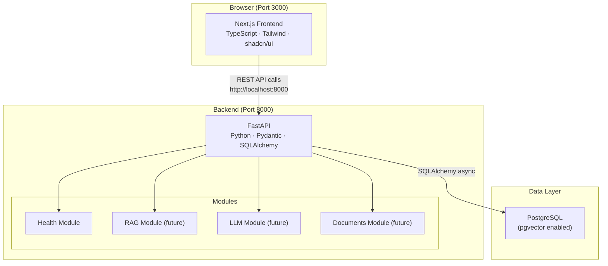

# LiDAR AI Assistant — System Architecture

## Overview

The LiDAR AI Assistant is a production-grade monorepo for a 3D LiDAR Annotation AI Knowledge Assistant. It uses a clean client/server architecture with a Next.js frontend, FastAPI backend, and PostgreSQL (Supabase) database.

> **Note**: The RAG engine and LLM integration are scaffolded but not yet implemented.

## System Diagram



## Components

| Component | Technology | Port | Description |
|---|---|---|---|
| Frontend | Next.js 14, TypeScript | 3000 | App Router, Tailwind, shadcn/ui |
| Backend API | FastAPI, Python 3.11 | 8000 | Async REST API, Swagger UI at `/docs` |
| Database | PostgreSQL 16 | 5432 | Primary store + pgvector for future embeddings |

## Folder Structure

```
lidar-ai-assistant/
├── frontend/              # Next.js app
│   ├── app/               # App Router pages & layouts
│   ├── components/        # Reusable UI components
│   ├── lib/               # API client, utilities
│   ├── services/          # Service layer (health, etc.)
│   └── types/             # TypeScript interfaces
│
├── backend/               # FastAPI application
│   ├── app/
│   │   ├── api/v1/        # Versioned API routes
│   │   ├── core/          # Config, database, security
│   │   ├── models/        # SQLAlchemy ORM models
│   │   ├── schemas/       # Pydantic request/response schemas
│   │   ├── services/      # Business logic layer
│   │   ├── rag/           # RAG pipeline (future)
│   │   ├── llm/           # LLM integration (future)
│   │   └── documents/     # Document ingestion (future)
│   └── migrations/        # Alembic database migrations
│
├── supabase/              # Supabase / PostgreSQL
│   ├── migrations/        # SQL migration files
│   └── config.toml        # Supabase CLI config
│
└── docs/                  # Project documentation
```
