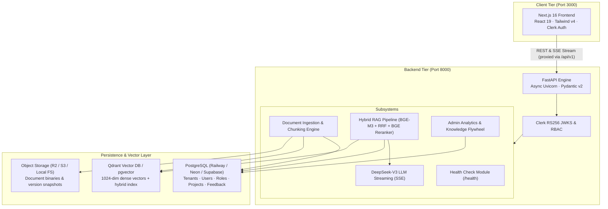

# ARIA — System Architecture & Implementation Overview

## 1. Overview

**ARIA** (**A**nnotation **R**AG **I**ntelligence **A**ssistant) is an enterprise multi-tenant retrieval-augmented intelligence platform engineered for autonomous vehicle perception teams and 3D LiDAR annotation workflows.

The system is built on a decoupled, asynchronous microservices architecture:
- **Frontend**: Next.js 16 (React 19, TypeScript, Tailwind CSS v4, shadcn/ui)
- **Backend API**: FastAPI 0.115 (Python 3.11+, Async SQLAlchemy 2, Pydantic v2)
- **Database & Storage**: PostgreSQL 16+ (Psycopg3 async), Qdrant / pgvector (1024-dim dense vectors), Cloudflare R2 / AWS S3
- **Inference & RAG**: BAAI/bge-m3 embeddings, BAAI/bge-reranker-v2-m3 cross-encoder, DeepSeek-V3 LLM streaming

---

## 2. System Architecture Diagram



---

## 3. Core Subsystems

| Subsystem | Key Files | Description |
|---|---|---|
| **App & Lifecycle** | `app/main.py`, `app/core/config.py` | Lifespan database/Qdrant initialization, seed bootstrapping, CORS middleware. |
| **Security & Auth** | `app/core/security.py`, `app/api/v1/endpoints/auth.py` | RS256 Clerk JWKS token validation with automatic key extraction, 7-tier RBAC. |
| **Document Ingestion** | `app/services/document/ingestion.py`, `manager.py` | PyPDF, python-docx, MD, TXT extraction. Sliding window chunking with page metadata. |
| **Vector Embeddings** | `app/services/embedding/service.py`, `factory.py` | BGE-M3 (1024 dimensions) with cosine similarity and SHA-256 deduplication. |
| **Hybrid Retrieval** | `app/services/rag/retrieval.py` | Dense vector search + BM25 keyword matching fused via Reciprocal Rank Fusion (RRF). |
| **Semantic Reranking** | `app/services/rag/reranker/service.py` | BGE Cross-Encoder reranker scoring top candidates for high precision. |
| **Grounded LLM Generation** | `app/services/rag/generator.py`, `prompt_composer.py` | Context-bounded prompting citing exact page and source metadata; DeepSeek-V3 SSE streaming. |
| **Admin & Flywheel** | `app/api/v1/endpoints/admin.py` | Real-time database metrics, active project counters, and downvote gap resolution. |

---

## 4. Directory Layout

```
aria/
├── frontend/                     # Next.js 16 client application
│   ├── app/                      # App router pages & layouts
│   │   ├── (auth)/               # Sign-in, sign-up & login routes
│   │   └── (dashboard)/          # Chat, documents, admin, dashboard, search, profile
│   ├── components/               # UI components, layout shell, chat modals
│   ├── lib/                      # Unified fetch client (api.ts) & services
│   └── public/                   # Static assets & brand media
│
├── backend/                      # FastAPI async backend
│   ├── app/
│   │   ├── api/v1/               # Versioned REST endpoints
│   │   ├── core/                 # Settings, database connection, security
│   │   ├── models/               # SQLAlchemy ORM models (12 tables)
│   │   ├── schemas/              # Pydantic validation schemas
│   │   └── services/             # Document, embedding, LLM, RAG services
│   └── tests/                    # Pytest test suite (RAG, auth, search, ingestion)
│
├── docs/                         # Architectural & operational documentation
└── docker-compose.yml            # Multi-container local orchestration
```

